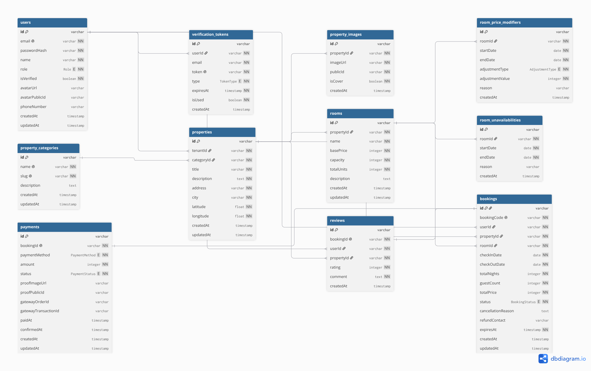

<div align="center">

# 🏡 SinggahIn
### *Mobile-First & SEO-Optimized Property Rental Marketplace*

[](https://www.typescriptlang.org/)
[](https://reactjs.org/)
[](https://vitejs.dev/)
[](https://nodejs.org/)
[](https://expressjs.com/)
[](https://www.postgresql.org/)
[](https://www.prisma.io/)
[](https://tailwindcss.com/)
[](https://www.docker.com/)

<p align="center">
  <b>SinggahIn</b> adalah platform <i>e-commerce web application</i> penyewaan properti penginapan berbasis <i>two-sided marketplace</i>. Menghubungkan <b>Penyewa (User)</b> yang mencari akomodasi dengan perhitungan harga dinamis transparan, dan <b>Pemilik Properti (Tenant)</b> yang mengelola inventaris kamar, seasonal pricing, serta laporan pendapatan.
</p>

[Fitur Utama](#-fitur-utama) • [Diagram ERD](#-entity-relationship-diagram-erd) • [Tech Stack & Arsitektur](#-arsitektur--tech-stack) • [Panduan Instalasi](#-panduan-instalasi--menjalankan-aplikasi) • [Pengujian](#-pengujian-testing) • [Struktur Monorepo](#-struktur-monorepo)

---

</div>

## 📌 Daftar Isi

- [Tentang Proyek](#-tentang-proyek)
- [Fitur Utama](#-fitur-utama)
- [Entity Relationship Diagram (ERD)](#-entity-relationship-diagram-erd)
- [Arsitektur & Tech Stack](#-arsitektur--tech-stack)
- [Struktur Monorepo](#-struktur-monorepo)
- [Panduan Instalasi & Menjalankan Aplikasi](#-panduan-instalasi--menjalankan-aplikasi)
  - [Prasyarat](#prasyarat)
  - [Konfigurasi Environment Variables](#konfigurasi-environment-variables)
  - [Opsi 1: Menjalankan dengan Docker Compose (Direkomendasikan)](#opsi-1-menjalankan-dengan-docker-compose-direkomendasikan)
  - [Opsi 2: Menjalankan Secara Lokal (Development Manual)](#opsi-2-menjalankan-secara-lokal-development-manual)
- [Pengujian (Testing)](#-pengujian-testing)
- [Ringkasan RESTful API Endpoints](#-ringkasan-restful-api-endpoints)
- [Lisensi & Kontributor](#-lisensi--kontributor)

---

## 📖 Tentang Proyek

**SinggahIn** dikembangkan untuk memberikan pengalaman reservasi penginapan yang mulus, responsif (*mobile-first*), aman, dan teroptimasi mesin pencari (*SEO-friendly*). Proyek ini dirancang dengan standar *enterprise-grade* menggunakan arsitektur **Domain-Driven Design (DDD)** pada backend serta **Atomic Design System** pada frontend.

### Nilai Utama Bisnis:
1. **Dynamic Calendar Pricing:** Penetapan harga sewa yang adaptif berdasarkan musim liburan (*peak season* / *holiday rates*), baik persentase maupun nominal.
2. **Zero Overbooking Engine:** Validasi ketersediaan kamar *concurrency-safe* berbasis rentang tanggal (*check-in* & *check-out*).
3. **SEO & Social Share Ready:** Injeksi dinamis Meta Tags, Open Graph, Twitter Cards, dan Schema.org JSON-LD (`LodgingBusiness`) menggunakan `react-helmet-async`.
4. **Secure Passwordless Lifecycle:** Registrasi awal berbasis verifikasi email token (1 jam TTL) dengan perlindungan JWT HttpOnly cookie & RBAC middleware.

---

## ✨ Fitur Utama

### 👤 1. Autentikasi & Akun (Identity Module)
- **Passwordless Initial Registration:** Pendaftaran cepat via email dengan pengiriman magic activation link (TTL 1 jam) via Nodemailer/SMTP.
- **Role-Based Access Control (RBAC):** Pemisahan hak akses ketat antara `USER` dan `TENANT`.
- **Manajemen Sesi:** JWT tersimpan di HttpOnly Cookie, mencegah kerentanan XSS/CSRF.
- **Profil & Avatar:** Pembaruan data pribadi serta unggah avatar pengguna terintegrasi ke Cloudinary CDN.

### 🏨 2. Katalog & Manajemen Properti (Property Module)
- **Multi-Category Properties:** Pengelompokan tipe akomodasi (Hotel, Villa, Apartemen, Guesthouse, dll.).
- **Foto Properti & Cover:** Unggah multi-foto dengan penandaan gambar sampul (*cover photo*).
- **Manajemen Kamar & Inventaris:** Pengaturan kapasitas tamu, fasilitas, dan jumlah unit kamar per tipe.
- **Date Blocking:** Fitur bagi tenant untuk menonaktifkan ketersediaan kamar pada tanggal tertentu (misal: perbaikan/renovasi).
- **Peak Season Rate Adjustment:** Penetapan kenaikan tarif khusus tanggal tertentu (persentase `%` atau nominal tetap `Rp`).

### 📅 3. Pencarian & Reservasi (Booking Module)
- **Pencarian Real-Time:** Filter berdasarkan kota, rentang tanggal menginap, kapasitas tamu, dan kategori.
- **Kalkulasi Harga Dinamis Otomatis:** Menghitung total biaya menginap dengan mempertimbangkan harga dasar kamar dan *peak season rates* pada setiap malam.
- **Pencegahan Overbooking:** Pengecekan unit kamar yang aktif untuk menghindari reservasi ganda pada periode yang sama.
- **Auto-Cancellation Scheduler:** Background cron job (`node-cron`) untuk membatalkan pesanan yang melewati batas waktu pembayaran secara otomatis.

### 💳 4. Pembayaran & Konfirmasi (Payment Module)
- **Dual Payment Method:**
  - **Transfer Manual:** Pengguna mengunggah bukti transfer bank (validasi gambar ketat, maks. 1MB) untuk disetujui atau ditolak oleh tenant.
  - **Payment Gateway:** Integrasi Midtrans Snap untuk pembayaran instan otomatis.
- **Notifikasi Email Transaksi:** Pengiriman konfirmasi pemesanan, invoice, dan status pembayaran langsung ke inbox pengguna.

### 📊 5. Laporan & Dasbor Tenant (Report Module)
- **Sales & Revenue Report:** Grafik dan ringkasan total pendapatan kotor/bersih per properti berdasarkan filter periode.
- **Kalender Ketersediaan Kamar:** Matriks visual kalender yang menampilkan okupansi kamar yang sedang terisi, kosong, atau di-blokir.

### ⭐ 6. Ulasan & Umpan Balik (Review Module)
- **Ulasan Terverifikasi:** Sistem rating bintang 1–5 dan testimoni tertulis yang hanya dapat diberikan oleh penyewa yang telah menyelesaikan proses menginap (*COMPLETED*).

---

## 🗺️ Entity Relationship Diagram (ERD)

Struktur data SinggahIn dimodelkan menggunakan PostgreSQL dan Prisma ORM dengan integritas relasional yang ketat, index komposit untuk optimasi performa query, serta format identifikasi CUID:

<div align="center">



</div>

### Entitas Utama Basis Data:
| Entitas | Deskripsi |
|---|---|
| `users` | Akun pengguna (`USER` atau `TENANT`), kredensial, role, dan profil avatar. |
| `verification_tokens` | Token sekali pakai (TTL 1 jam) untuk aktivasi akun dan reset password. |
| `property_categories` | Klasifikasi kategori properti (Hotel, Villa, Apartemen, dll.). |
| `properties` | Data utama properti (nama, deskripsi, alamat, kota, koordinat latitude/longitude). |
| `property_images` | Foto galeri properti yang tersimpan di Cloudinary dengan penanda `isCover`. |
| `rooms` | Tipe kamar, harga dasar per malam, kapasitas tamu, dan jumlah unit fisik. |
| `room_price_modifiers` | Modifikasi harga musiman (*peak rates*) per rentang tanggal (persentase/nominal). |
| `room_unavailabilities` | Periode penonaktifan unit kamar secara manual oleh tenant. |
| `bookings` | Rekam transaksi reservasi tamu dengan status siklus pemesanan. |
| `payments` | Rekam pembayaran, metode (Manual / Gateway), status approval, dan URL bukti bayar. |
| `reviews` | Rating dan ulasan dari pengguna untuk properti yang telah selesai disewa. |

---

## 🏗️ Arsitektur & Tech Stack

Proyek ini menerapkan prinsip **Clean Architecture & Domain-Driven Design (DDD)** untuk menjaga kode tetap modular, terisolasi, mudah diuji, dan skalabel:

```
[ Client Browser ]
        │ (HTTPS / Mobile-First Responsive UI)
        ▼
[ Nginx Reverse Proxy & SSL ]
   ├── /api/v1/*  ──> [ Express.js Backend (Node.js + TS) ]
   │                        ├── Domain Modules (DDD: Identity, Property, Booking, Payment, Report)
   │                        ├── Middleware (JWT, RBAC, Multer 1MB, Validation)
   │                        ├── Prisma ORM
   │                        └── [ PostgreSQL Database ]
   └── /*         ──> [ Vite + React Frontend SPA (Atomic Design) ]
```

### 💻 Rincian Teknologi:

| Layer | Teknologi & Pustaka |
|---|---|
| **Frontend** | React 18, Vite, TypeScript, Tailwind CSS, Radix UI / Lucide React |
| **State & Data Fetching** | TanStack Query (React Query) v5, Zustand |
| **Validasi Skema** | Zod (Digunakan konsisten pada frontend forms dan backend DTOs) |
| **SEO & Meta Tags** | `react-helmet-async` (Dynamic Title, Open Graph, Twitter Cards, Schema.org JSON-LD) |
| **Backend Core** | Node.js (v20+), Express.js, TypeScript (Layered Domain-Driven Architecture) |
| **Database & ORM** | PostgreSQL 16 Alpine, Prisma ORM 5.x |
| **Media & Penyimpanan** | Cloudinary CDN SDK (Validasi unggah via Multer Memory Storage, maks 1MB) |
| **Mailing Service** | Nodemailer / Resend SMTP Service |
| **Task Scheduler** | `node-cron` (Auto-cancel expired booking) |
| **Pengujian** | Vitest, React Testing Library, Supertest |
| **DevOps & Container** | Docker, Docker Compose, Nginx Reverse Proxy, Let's Encrypt SSL |

---

## 📁 Struktur Monorepo

```text
singgahin/
├── backend/                  # RESTful API Backend (Express.js + TypeScript + Prisma)
│   ├── prisma/               # Schema Prisma & Database Seeders
│   ├── src/
│   │   ├── modules/          # DDD Bounded Contexts (identity, property, booking, dll.)
│   │   │   ├── <domain>/
│   │   │   │   ├── __tests__/
│   │   │   │   ├── <domain>.controller.ts
│   │   │   │   ├── <domain>.service.ts
│   │   │   │   ├── <domain>.routes.ts
│   │   │   │   ├── <domain>.schema.ts
│   │   │   │   └── <domain>.types.ts
│   │   ├── shared/           # Shared Middlewares, Utilities, & Service Adapters
│   │   └── index.ts          # Server Entry Point
│   ├── Dockerfile            # Multi-stage Docker Build Backend
│   └── package.json
├── frontend/                 # Client Application (React + Vite + TypeScript)
│   ├── src/
│   │   ├── components/       # Atomic Design System (atoms/, molecules/, organisms/)
│   │   ├── modules/          # DDD Feature Modules (components, services, hooks, schemas)
│   │   ├── pages/            # Page Route Handlers
│   │   ├── stores/           # Zustand Global Stores (auth, UI)
│   │   ├── libs/             # Axios client, Formatters, & Helper Adapters
│   │   └── App.tsx           # Application Router & Providers
│   ├── Dockerfile            # Multi-stage Docker Build Frontend
│   └── package.json
├── docs/                     # Dokumentasi Proyek, PRD, & ERD
│   ├── erd.png               # Visual Entity Relationship Diagram
│   ├── brief.pdf
│   └── prd-feature-singgahin-02092026.md
├── nginx/                    # Nginx Reverse Proxy Configuration
│   └── conf.d/default.conf
├── docker-compose.yml        # Orchestration (Postgres, Backend, Frontend, Nginx)
├── .env.example              # Template Environment Variables
└── README.md                 # Dokumentasi Utama Repository
```

---

## 🚀 Panduan Instalasi & Menjalankan Aplikasi

### Prasyarat:
- [Git](https://git-scm.com/)
- [Node.js](https://nodejs.org/) v20.x atau lebih baru
- [Docker](https://www.docker.com/) & [Docker Compose](https://docs.docker.com/compose/) (untuk deployment / containerized environment)
- Akun Cloudinary (untuk upload foto avatar & properti)

---

### Konfigurasi Environment Variables

Salin file `.env.example` menjadi `.env` pada direktori root, lalu lengkapi nilainya:

```bash
cp .env.example .env
```

Contoh konfigurasi penting di file `.env`:
```ini
PORT=5000
CLIENT_URL=http://localhost

# Database PostgreSQL
POSTGRES_USER=postgres
POSTGRES_PASSWORD=postgres_secure_password
POSTGRES_DB=singgahin_db
POSTGRES_PORT=5432

# Keamanan JWT
JWT_SECRET=singgahin-super-secret-jwt-key-production
JWT_EXPIRES_IN=1d

# Integrasi Cloudinary
CLOUDINARY_CLOUD_NAME=nama_cloud_anda
CLOUDINARY_API_KEY=api_key_anda
CLOUDINARY_API_SECRET=api_secret_anda

# Layanan Email SMTP
SMTP_HOST=smtp.gmail.com
SMTP_PORT=587
SMTP_USER=email_anda@gmail.com
SMTP_PASS=app_password_anda
SMTP_FROM="SinggahIn <no-reply@singgahin.com>"
```

---

### Opsi 1: Menjalankan dengan Docker Compose (Direkomendasikan)

Cukup jalankan satu perintah berikut di root folder:

```bash
# Build dan jalankan seluruh container (Postgres, Backend, Frontend, Nginx)
docker compose up -d --build

# Pantau status container
docker compose ps
```

Setelah seluruh container berjalan:
- **Web App (Frontend via Nginx):** `http://localhost`
- **Backend REST API:** `http://localhost/api/v1`
- **PostgreSQL Database:** `localhost:5432`

Untuk menghentikan container:
```bash
docker compose down
```

---

### Opsi 2: Menjalankan Secara Lokal (Development Manual)

Jika ingin menjalankan backend dan frontend secara langsung di mesin lokal:

#### 1. Setup Backend:
```bash
cd backend
npm install

# Jalankan migrasi database dan seeding data awal
npx prisma migrate dev --name init
npx ts-node prisma/seed.ts

# Jalankan server backend development
npm run dev
```
Backend akan berjalan di `http://localhost:5000`.

#### 2. Setup Frontend:
Buka tab terminal baru:
```bash
cd frontend
npm install

# Jalankan development server Vite
npm run dev
```
Frontend akan berjalan di `http://localhost:5173`.

---

## 🧪 Pengujian (Testing)

Seluruh modul backend dan frontend telah dilengkapi dengan unit test & integration test untuk memastikan keandalan sistem:

```bash
# Menjalankan seluruh pengujian backend
npm test --prefix backend

# Menjalankan pengujian backend dengan coverage
npm test --prefix backend -- --coverage

# Menjalankan seluruh pengujian frontend
npm test --prefix frontend -- --run
```

---

## 📡 Ringkasan RESTful API Endpoints

| Modul | Method | Endpoint | Deskripsi | Akses |
|---|---|---|---|---|
| **Identity** | `POST` | `/api/v1/identity/register` | Pendaftaran akun via link email token | Publik |
| | `POST` | `/api/v1/identity/verify` | Verifikasi token & setel kata sandi | Publik |
| | `POST` | `/api/v1/identity/login` | Masuk ke akun (Set HttpOnly cookie) | Publik |
| | `POST` | `/api/v1/identity/logout` | Keluar dari akun & hapus cookie | Otentikasi |
| | `GET` | `/api/v1/identity/me` | Ambil data profil pengguna yang login | Otentikasi |
| | `PATCH` | `/api/v1/identity/profile` | Perbarui informasi profil pengguna | Otentikasi |
| | `POST` | `/api/v1/identity/avatar` | Unggah foto profil pengguna ke Cloudinary | Otentikasi |
| **Property** | `GET` | `/api/v1/properties` | Daftar properti dengan filter kota & tanggal | Publik |
| | `GET` | `/api/v1/properties/:id` | Detail properti & ketersediaan kamar | Publik |
| | `POST` | `/api/v1/properties` | Buat listing properti baru | Tenant |
| | `POST` | `/api/v1/properties/:id/peak-rates` | Atur penyesuaian harga musiman | Tenant |
| **Booking** | `POST` | `/api/v1/bookings` | Reservasi kamar pada rentang tanggal | User |
| | `GET` | `/api/v1/bookings/my` | Riwayat pemesanan pengguna | User |
| | `PATCH` | `/api/v1/bookings/:id/cancel` | Pembatalan pemesanan | User / Tenant |
| **Payment** | `POST` | `/api/v1/payments/upload-proof` | Unggah bukti transfer manual (Maks 1MB) | User |
| | `PATCH` | `/api/v1/payments/:id/approve` | Konfirmasi pembayaran manual | Tenant |
| | `POST` | `/api/v1/payments/midtrans-webhook` | Webhook notifikasi status payment gateway | System |
| **Report** | `GET` | `/api/v1/reports/revenue` | Laporan pendapatan per periode | Tenant |
| | `GET` | `/api/v1/reports/occupancy` | Matriks kalender ketersediaan kamar | Tenant |

---

## 👥 Lisensi & Kontributor

Dikembangkan oleh **Papua Dev** sebagai Final Project di **Purwadhika Digital Technology School**.

© 2026 **SinggahIn**. All Rights Reserved.
